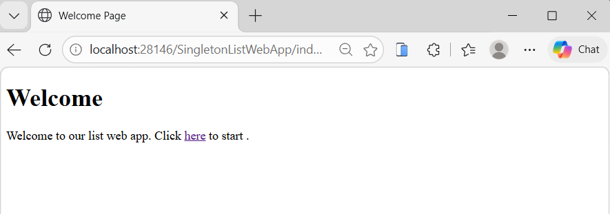
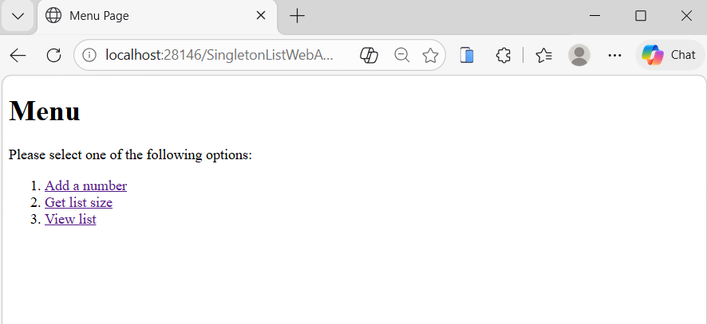
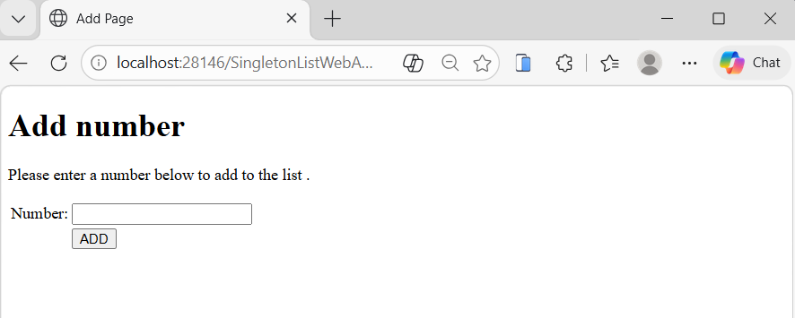
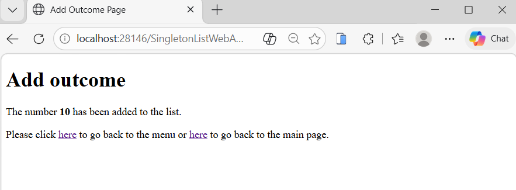
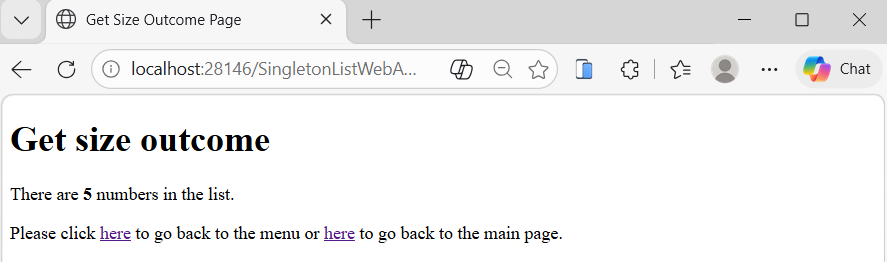
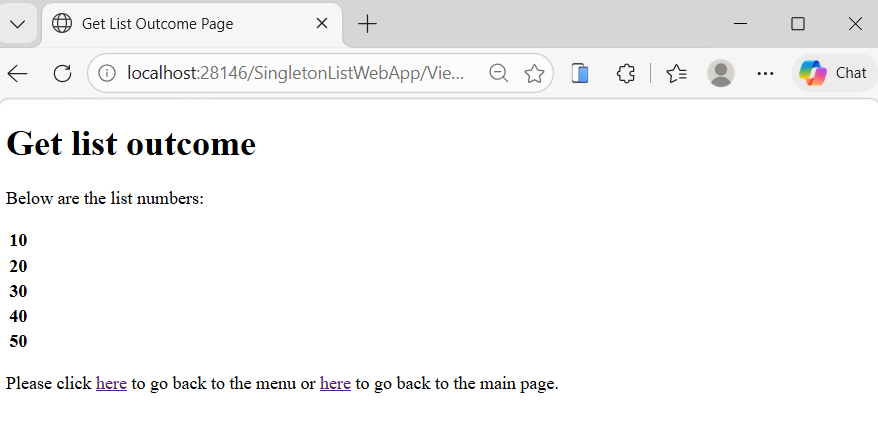

# SingletonListWebApp# SingletonListWebApp

A Java EE web application demonstrating the use of Singleton Session Beans (EJB) to manage shared data across multiple clients. The application allows users to add numbers to a shared list, view the list, and retrieve its size.

---

## Overview

This project demonstrates how a Singleton Session Bean works in an enterprise application.

A Singleton ensures that:

* Only one instance of the bean exists
* Multiple users share and manipulate the same data

In this application, users can:

* Add numbers to a shared list
* View all stored numbers
* Get the total number of elements in the list

---

## Key Concept

* Singleton Session Bean (EJB): A single shared object across the entire application
* Enables multiple clients to interact with the same data source
* Suitable for shared resources such as counters, ticket systems, and shared lists

---

## Screenshots

| Screenshot                                     | Description                     |
| ---------------------------------------------- | ------------------------------- |
|             | Welcome page                    |
|                   | Navigation menu                 |
|       | Add number form                 |
|     | Result after adding a number    |
|   | Display list size               |
|  | Display all numbers in the list |

---

## Technologies Used

* Java 8
* Java EE (EJB, Servlets, JSP)
* HTML5
* GlassFish Server 4.1.1
* NetBeans IDE

Build and compiled files are excluded using `.gitignore`.

---

## Features

* Add numbers to a shared list using a Singleton bean
* Retrieve the size of the list
* Display all stored numbers
* Shared state across multiple requests and users
* Separation between business logic (EJB) and presentation (JSP)

---

## Project Structure

```
SingletonListWebApp/
│
├── src/java/za/ac/tut/web/
│   ├── AddServlet.java
│   ├── GetSizeServlet.java
│   ├── ViewServlet.java
│
├── src/java/za/ac/tut/model/bl/
│   └── SingletonListSB.java
│
├── web/
│   ├── index.html
│   ├── menu.html
│   ├── add.html
│   ├── add_outcome.jsp
│   ├── get_size.html
│   ├── get_size_outcome.jsp
│   ├── view.html
│   ├── get_list_outcome.jsp
│
├── screenshots/
│   ├── welcome.png
│   ├── menu.png
│   ├── add_number.png
│   ├── add_outcome.png
│   ├── get_size_outcome.png
│   ├── get_list_outcome.png
│
├── WEB-INF/
│   └── web.xml
│
├── .gitignore
├── README.md
```

---

## Learning Outcomes

* Understanding Singleton Session Beans
* Managing shared data in enterprise applications
* Using EJB with Servlets
* Handling multiple client requests with shared state
* Separating business logic from presentation layer

---

## How to Run

1. Clone the repository:

   ```
   git clone https://github.com/LungeloMK/SingletonListWebApp.git
   ```

2. Open the project in NetBeans

3. Configure GlassFish Server 4.1.1

4. Run the application

5. Access in browser:

   ```
   http://localhost:8080/SingletonListWebApp/
   ```

---

## Notes

* The Singleton bean maintains a shared list of numbers
* All users interact with the same data instance
* Demonstrates real-world use of shared application state

---

## Author

Lungelo
